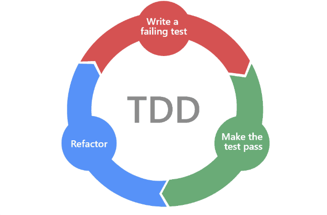

# 단위 테스트

## TDD(Test Driven Development)란?

- **TDD(테스트 주도 개발, Test Driven Development)**란, 실제 코드를 작성하기 전에 **단위 테스트를 먼저 작성**하는 개발 방식이다.
- TDD는 코드 품질을 높이고, 유지보수성을 향상시키며, 결함을 줄이는 데 효과적이다.

## TDD의 3가지 법칙

1. **첫째 법칙**: 실패하는 단위 테스트를 작성할 때까지 실제 코드를 작성하지 않는다.
2. **둘째 법칙**: 컴파일은 성공하지만 실행이 실패하는 정도까지만 단위 테스트를 작성한다.
3. **셋째 법칙**: 현재 실패하는 테스트를 통과할 정도로만 실제 코드를 작성한다.

- 위 법칙을 따르면, 사실상 **모든 코드를 검증하는 테스트 케이스가 만들어진다.**
- 하지만 테스트 코드가 지나치게 많아지면 유지보수 및 관리가 어려워질 수 있다.

## 테스트 코드와 코드 품질

- **의도하지 않은 결함**이 많아지면 개발자는 **코드 변경을 주저**하게 된다.
- 코드 변경 시 **득보다 실이 많다고 판단**하면, 코드 정리를 하지 않게 되고, 결국 코드가 점점 더 **망가진다.**
- 따라서, **테스트 코드 역시 실제 코드만큼 깨끗하게 작성해야 한다.**

### 테스트 코드의 장점

- **유연성** 증가
- **유지보수성** 향상
- **재사용성** 보장

### 테스트 코드가 지저분하면?
- 코드를 변경하는 능력이 떨어지고, 코드 구조를 개선하는 능력도 감소한다.
- 결과적으로 **테스트 코드가 지저분할수록 실제 코드도 지저분해진다.**

## 깨끗한 테스트 코드 작성법

### 가장 중요한 3가지 요소
**가독성, 가독성, 가독성** → **그만큼 가독성이 중요하다!**

- **테스트 언어**는 테스트를 작성하는 사람뿐만 아니라, **나중에 테스트를 읽을 사람도 고려해야 한다.**

## 이중 표준 (Double Standard)

- **실제 환경에서는 금지된 방식**이지만, **테스트 환경에서는 허용되는 방식**이 존재할 수 있다.
- 예를 들어, 실제 환경에서는 DB를 직접 조작하지 않지만, 테스트 환경에서는 테스트 데이터를 빠르게 세팅하기 위해 직접 삽입하는 경우가 있다.

## TEMPLATE METHOD 패턴이란?

- **템플릿 메소드 패턴(Template Method Pattern)**은 **상위 클래스에서 알고리즘의 구조를 정의**하고, **하위 클래스에서 특정 단계를 구현하도록 하는 디자인 패턴**이다.
- 테스트 코드에서도 이 패턴을 활용하여 **중복을 줄이고 코드 재사용성을 높일 수 있다.**

## 깨끗한 테스트 코드 작성의 5가지 규칙 (F.L.R.S.T)

1. **빠르게 (Fast)**: 테스트는 빠르게 실행되어야 한다.
2. **독립적으로 (Independent)**: 각 테스트는 서로 의존하면 안 된다.
3. **반복 가능하게 (Repeatable)**: 테스트는 어떤 환경에서도 동일한 결과를 보장해야 한다.
4. **자가 검증 (Self-Validating)**: 테스트 결과는 반드시 **참/거짓**(Boolean) 값으로 나와야 한다.
5. **적시에 (Timely)**: 테스트는 적시에 작성해야 하며, 너무 늦게 작성하면 코드 품질이 저하될 수 있다.

## 결론

- 테스트 코드는 **지속적으로 깨끗하게 관리**되어야 한다.
- 테스트 코드 작성 시 **표현력을 높이고, 간결하게 정리**하며, **테스트 API를 구현하여 도메인 특화 언어(DSL)**를 만들면 더욱 효과적이다.
- 궁극적으로, **깨끗하고 완벽한 코드를 작성하기 위해 테스트를 적극적으로 활용해야 한다.**
- 테스트를 작성할 때도 **Clean Code 원칙을 적용하여 코드의 유연성, 유지보수성, 재사용성을 보존하고 강화하라!**